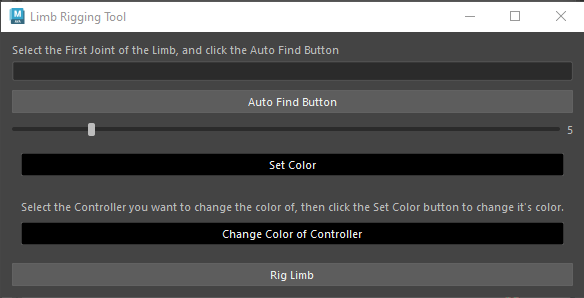
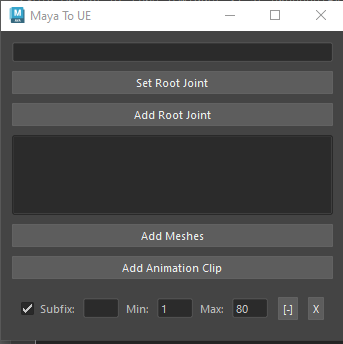

# Maya Plugins

This is a collection of maya plugins to help with rigging and other stuff

# How to Install:

Drag the install.mel file into maya's viewport, and the tool will appear under the currently selected shelf.

## Limb Rigger

Rigs any 3 joint limb.
* Auto find the joints after selecting the parent joint
* Control the controller size
* Control the controller color
* Modular approach
* Set color of any selected controller

## Maya To Unreal Engine

* Creates a root joint if needed for exporting to Unreal Engine.
* Allows export of a selected mesh that has been rigged to Unreal Engine.
* Allows user to set amount of frames for exporting animation to Unreal Engine.